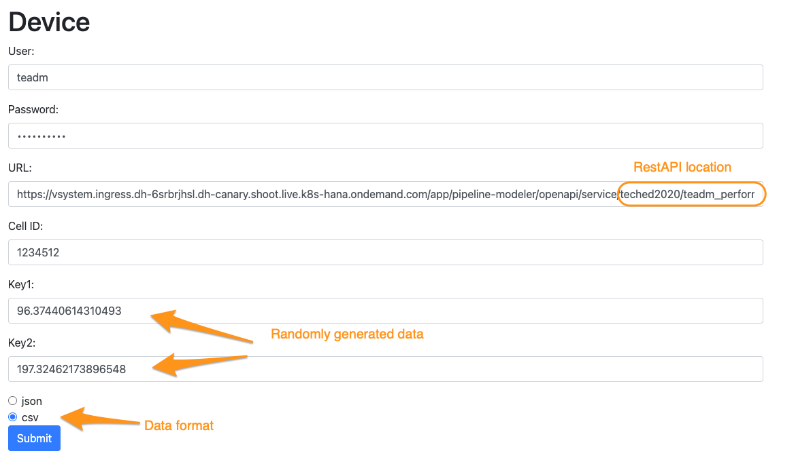
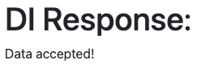
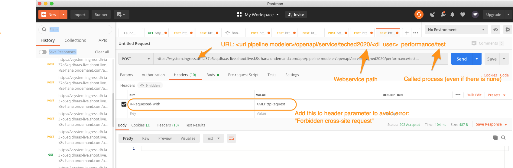
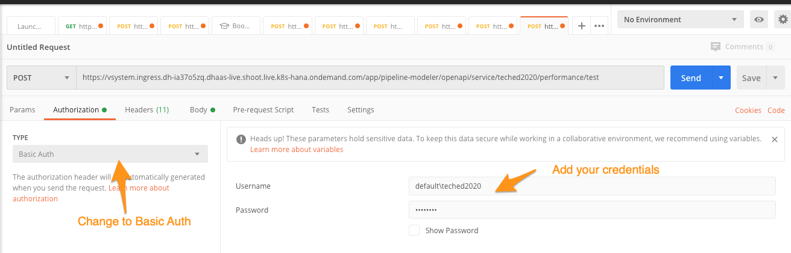
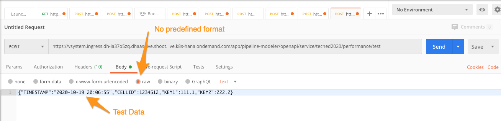

# Exercise 3 (2h-W): Sending Device Data via Rest API

## Description
In this exercise we create a Rest API service that can be called by devices to save the performance data to a file. This could be the very beginning of the whole use case you just accomplished so far.  
1. Devices are sending data to SAP Data Intelligence
2. Data is written to the HANA database
3. Quality assurance test verifies if the data is within the expected boundaries.
4. All failed data are recorded to a `QMTICKET` table to rectify the data or resolve any issues with devices
5. Further analysis by a data scientist could develop more sophisticated quality checks and create and even better prediction on failed data


## Exercise Summary

Creating a Pipeline with a web-service that can be called externally and hand over the data to an operator for further processing before calling an operator for saving the data.

In order to test the Rest API service a client application is provided which can generate and send example data to web service. You may alternatively use the Postman application or the terminal command `curl`.

## Exercise 3.1
Each running pipeline consumes a node in the cluster. Due to the limited size of our workshop-cluster we ask you kindly to ensure that the web-service pipeline is only running as short as possible. For testing purpose we write the web-service response to a file and then terminate the graph.

Creating the basic RestAPI:

1. Create new Graph
2. Add the RestAPI operator **OpenAPI Servlow** and the **Wiretap** operator
3. Configure the **OpenAPI Servlow** operator
	1.  Base Path: 'teched2020/\<di_user\>\_performance - This defines which service the Web-server calls. (Attention: No leading '/')
	2. One-Way: True (operator is not waiting for a response but sends immediately HTTP 204 back.
4. Add the **Write File** operator and the **To File** converter
5. Configure the **Write File** operator for adding the data to your `performance.csv`:
	1. Connection: DI_DATA_LAKE
	2. Path mode: "Static (from configuration)
	3. Path: */shared/\<di_user\>/performance.csv*
	4. Mode: "Append"
6. Add the **Workflow Terminator** to the graph. Of course if run productively there would be no "Terminator" but run perpetually.
7. Connect all operators  
8. Save the pipeline as `taxx.DeviceRestAPI`


#### Test

1. Now you can start the pipeline
2. When the pipeline is running send a sample HTTP POST request
3. The received request will be saved to the target file/directory and then the pipeline should gracefully terminate
4. Check the contents of file using Metadata Explorer.


### HTML Test Page

The easiest way to test the Rest API is using the small web application we have developed for this workshop [https://sendcelldata.cfapps.eu10.hana.ondemand.com](https://sendcelldata.cfapps.eu10.hana.ondemand.com).

Be sure to use your `TAxx` credentials.





### (Optional) Using Postman to test REST API
#### Request URL


Substitute the URL and the user ID and send a POST request to: `https://<url pipeline modeler>/openapi/service/ta<xx>_performance/test`

It is important to add a process-tag at the end, otherwise the request gets an error although the process tag is not used.

#### Request Header
In the "Headers"-tab add the parameter: X-Requested-With - XMLHttpRequest. Without this parameter you get the error: "Forbidden cross-site request"



#### Authorization
1. Change the authorization TYPE: Basic Auth
2. The username must be prefixed with the tenant ID followed by a backslash e.g. `dat263\taXX`



#### Request Body

In the body you can add the actual data that should be posted. Here we can add already a JSON that contains the data of the device:

`{"TIMESTAMP":"2020-10-19 20:06:55","CELLID":1234512,"KEY1":111.1,"KEY2":222.2}`




### Python client

If you have a python-engine installed on your local system then you could also use the script that you have downloaded from this GitHub repository together with the Jupyter Notebook: [scripts.zip](../../scripts.zip).

First you have to ensure that the url in the script is the right one. Open the script with a text editor and verify and adjust the url described in the section Postman/Request URL.

Start the RestAPI pipeline and when running then start the script in a terminal with:

```
python3 ./celldata.py --cellid 1234512 --user <di_user> --pwd <password>
```

## Summary

In this final exercise you have learnt how to setup and send data -- using various HTTP clients -- to a Rest API web service hosted inside SAP Data Intelligence.
