# Exercise 1: Appending multiple source files to a single file

In this exercise, you will use the Metadata Explorer to explore and view a batch of files stored in an Amazon S3 bucket. Then, using the Pipeline Modeler you will read this entire of batch of files and consolidate them into a single csv file that will be used in a later exercise.

  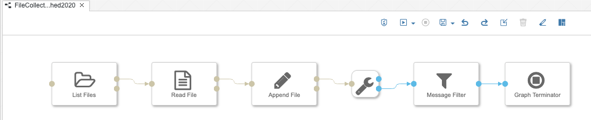

## Part 1: Preview the source data in Metadata Explorer

**Objective**: To better understand the data we will be working in the later sections of this exercise we will first preview the datasets using the Metadata Explorer.

1. Select the Metadata Explorer from the drop-down menu in the top-left of the screen or by clicking on the Metadata Explorer tile in the Launchpad.

  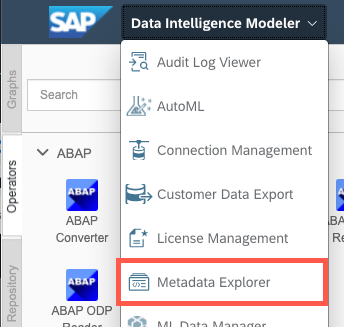

2. Click on **Browse Connections**

  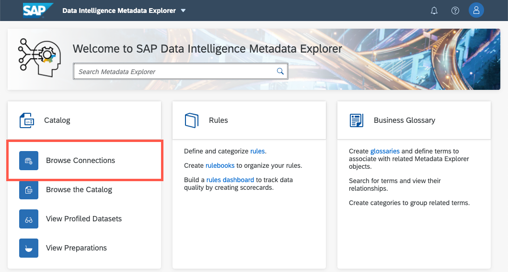

3. Select the ```device_performance``` directory. This directory contains all of the source .csv files that we will be appending in the next section of this exercise.

  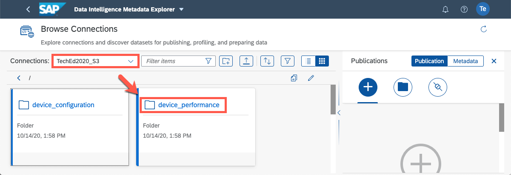

4. Click on the **View Factsheet** button

  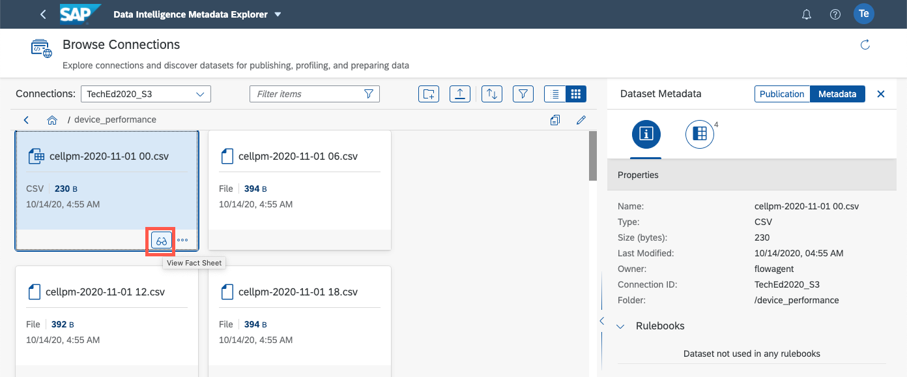

5. Click on the **Data Preview** button. You should see that our source file contains four unlabelled columns: A timestamp, a device ID, and two columns describing the value of this device.

  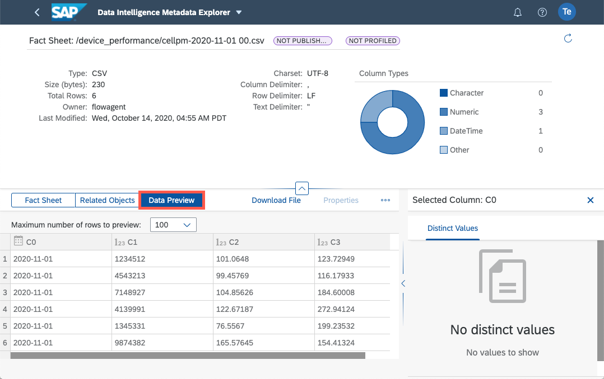

## Part 2: Building the pipeline

**Objective**: In the previous section you observed that the ```device_performance``` directory contains multiple small source csv files that contain four columns. In this section we will read the contents of these sources file and re-write them into a single output csv file.

1. Return to the  Modeler by using the dropdown menu in the upper left corner of your screen.
  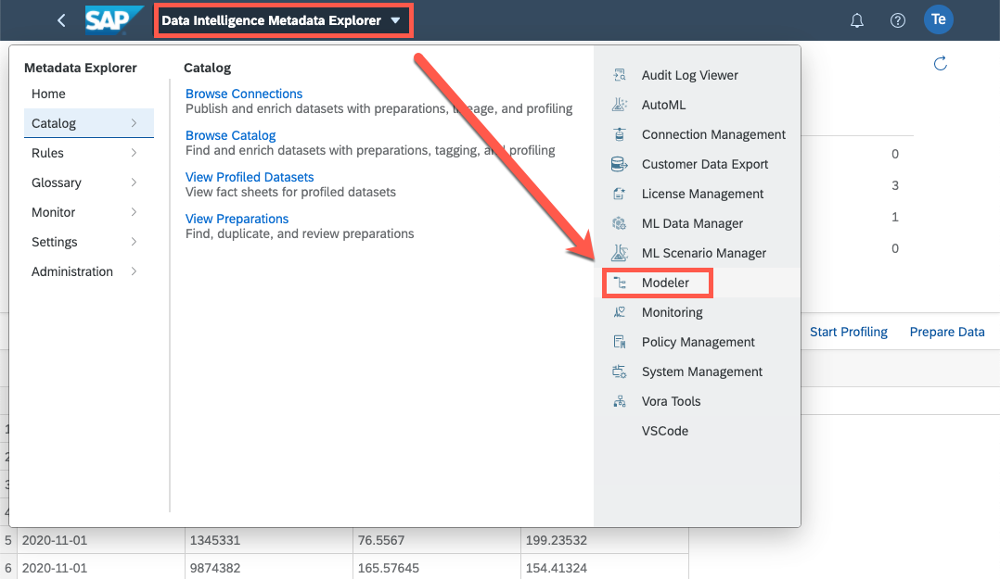

2. Create a new graph by first selecting the `Graphs` tab (shown vertically) and then the **+** button.
  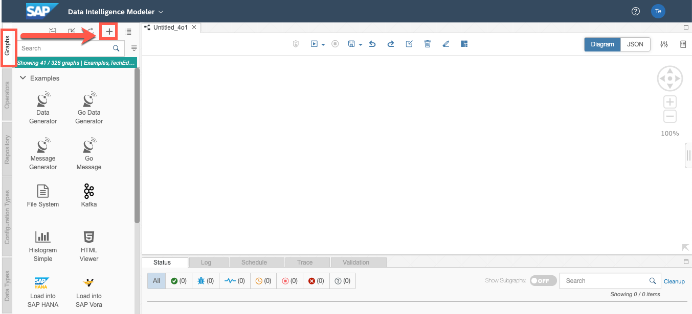


3. When creating a new graph the modeler should automatically switch to the `Operators` tab (shown vertically), if not then select it. Use the search field to find the `List Files` operator and drag-and-drop it into the new empty graph.
  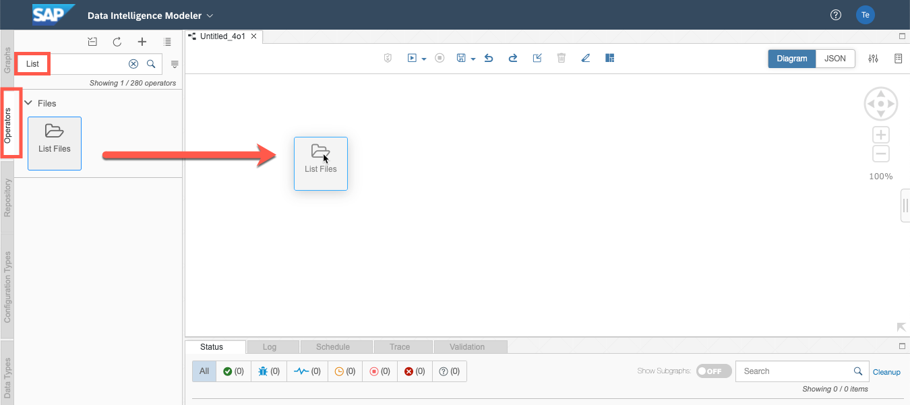

4. The `List Files` operator takes a directory as an input or configurable parameter and outputs a list of all files and sub-directories in a given storage service such as Amazon S3 buckets. You can view more information about this operator by right clicking it and select `Open Documentation`.

  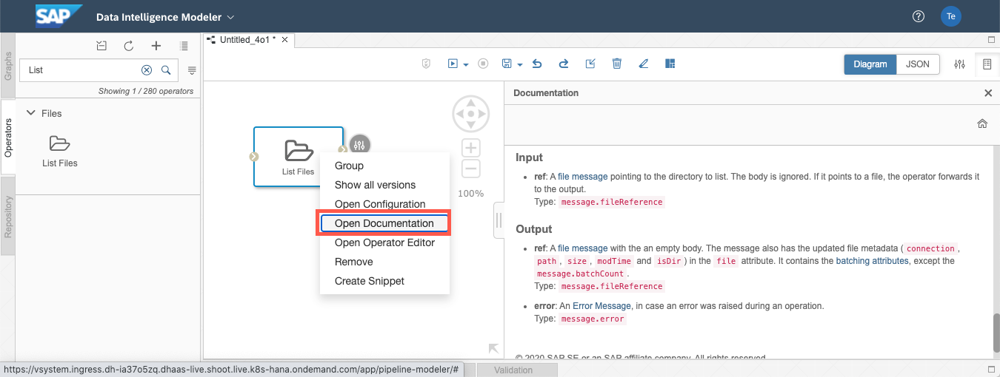

5. Like many other operators the `List File` operator will by default read configuration parameters from its input node `dirRef` during runtime. However, in this exercise the parameters will be provided during design time:
  - Configure the `List Files` operator by right clicking and selecting `Open Configuration`
  - Set the list operation to occur only `Once`
  - Select the **pencil icon** to define which storage account to read from.

  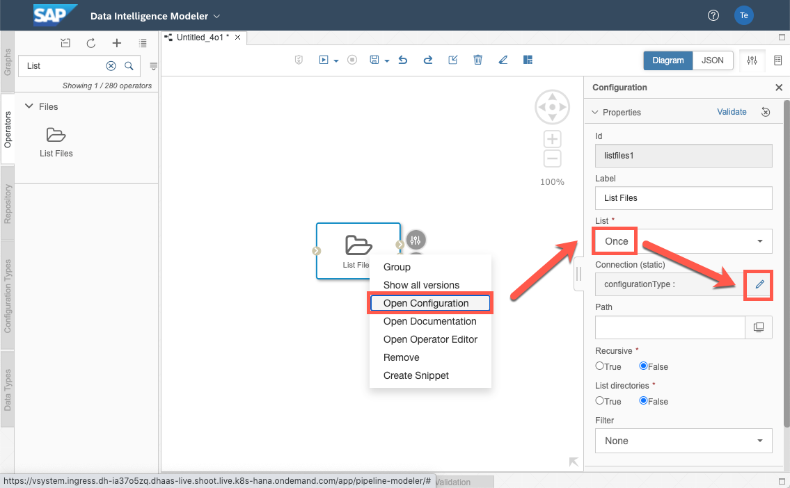

6. Set the **Configuration Type** to `Connection Management`  and **Connection ID** to `TechEd2020_S3` and select **Save**
 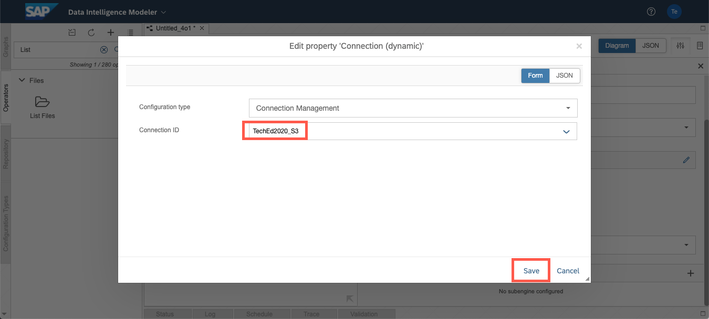

7. Browse the connection by clicking on the **monitor icon** and select the path directory `/device_performance` and click **Save**

8. Now would be a great time to save your progress. Click on the **floppy disk** icon located in the toolbar at the top of the screen. Enter the name `FileCollectionPerformance_TAxx` where xx is the ID assigned to you at the beginning of the workshop.

  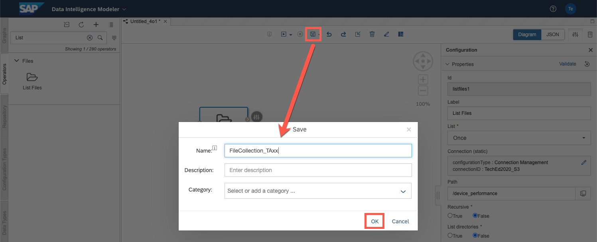

9. Use the search field to find the `Read File` operator. Drag and drop it into your graph. This operator reads the contents of files from various storage services.

  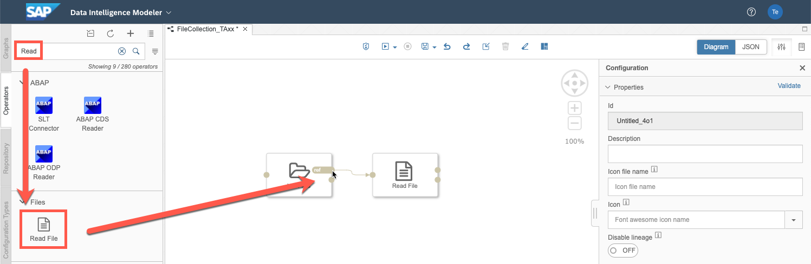

10. The file path to be read by the `Read File` operator can be provided either via its input node at runtime or configured at design time. In this exercise we will provide the path at runtime using the `List File` operator. Connect the output node `ref`  to the input node of the `Read Operator`

11. Use the search field to find the `Write File` operator.  Drag and drop it into your graph. The `Write File` operator writes any content that is provided to its input node as a file to various object store services. Connect the output node `file` to the input node of the `Write File` operator.

12. Like the `Read File` operator the `Write File` operator can be configured at runtime or design time. In this exercise we will provide the target directory at design time.
- Select **Path Mode** to `Static`
- Click on the **pencil button** to select the `DI_DATA_LAKE` connection.
- Set **Mode** to `Append`
- Since the file we want to write does not yet exist we cannot browse for the path. Instead manually enter the following path: `/shared/TAxx/performance.csv` (TAxx = your username)
- *\[Optional\]* You can rename the label of the `Write File` operator to `Append File`. This can be helpful for other users to understand what the pipeline is designed to do at a glance.
  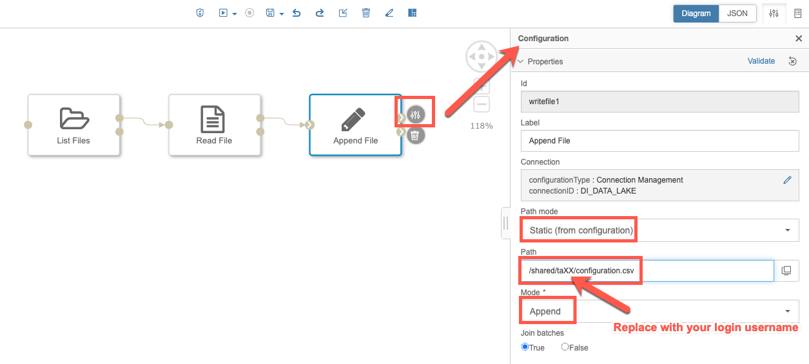

13. When the `Write File` operator has successfully written the last batch of data it will mark its last message output with an attribute `lastBatch`. We can listen for this attribute and create a trigger to safely terminate the pipeline.
  - Use the search field to find the `Python3` operator, drag and drop it into your graph.
  - Right click it and select open configuration: Set the label to read `Message Filter`
  - Right click the operator again and select `Add Port`. Do this twice to add the following two ports:

  |Name    |Type        |Data Type|Data Type Name|
  |--------|------------|---------|--------------|
  |input   |input port  |Basic    |message.file  |
  |output  |output port |Basic    |any.*         |

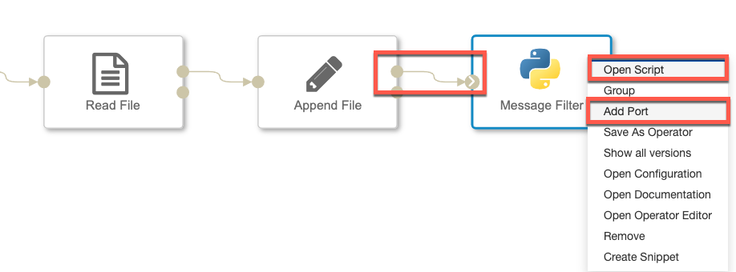

  - Connect the `file` output node to the python operator's input node, and the
  - Right click the python3 operator and select `Open Script`. This will open a code editor as a new tab inside the Modeler.
  - Delete any pre-existing code and copy/paste below text snippet. Afterwards you may close the code editor tab.

```
def on_input(data):

# If the attribute lastBatch is set then send an output, else do nothing
  if data.attributes.get("message.lastBatch",False):
    api.send("output", True)

# When an input is received, call the function on_input()
api.set_port_callback("input", on_input)
```    


14. Use the search field to find the `Graph Terminator` operator. Drag and drop it into your graph. This operator will terminate the pipeline execution when receiving any input to its input node. Connect the output node your `python3` operator to the input node of the `Graph Terminator`.

  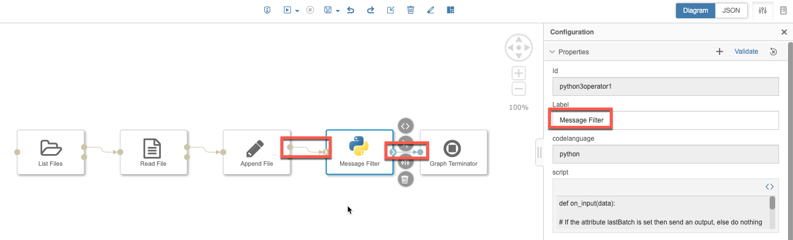

  Since the custom `Message Filter` operator is filtering out all messages that do not contain the `lastBatch` attribute the graph will not be terminated until we are sure that the last batch of data was written by `Write File` operator.

15. Save the graph by clicking on the **floppy disk** icon located in the toolbar at the top of the screen.


## Part 3: Executing the pipeline

Now that you've completed designing your graph it is time to execute it and inspect the output data.

1. To execute the pipeline click on the **play button** at the top of the screen. The pipeline will appear under the **Status** tab. It will first appear to be in status ``Pending`` and then after a few seconds ``Running``.

  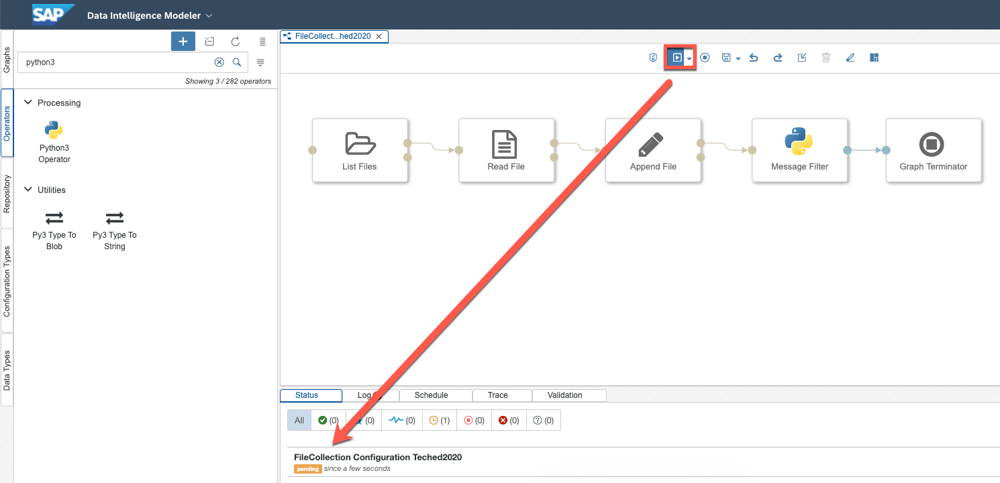

2. If the pipeline did not run into any errors then the execution should reach the `Graph Terminator` operator and the status will eventually switch to status `Completed`.

  **Tip:** *If the pipeline terminates with an error you can click on the title of the failed graph to view a detailed error message.*

  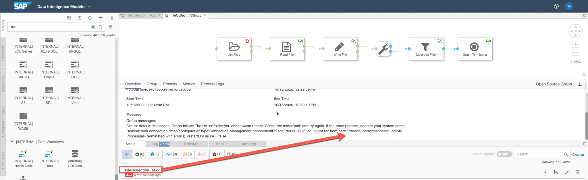

3. After the pipeline reaches status `Completed` return to the **Metdata Explorer** using the drop-down menu in the top left corner of the screen.

  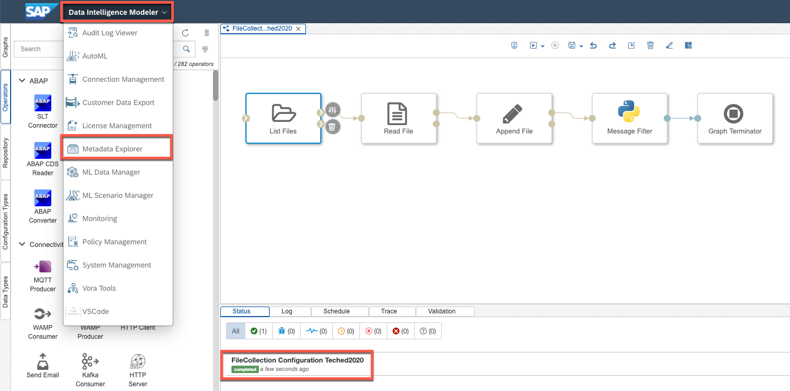

4. Click on **Browse Connections** and navigate to the `/input/TAxx` directory in the `TechEd2020_S3` connection.

5. Click on on the **View Factsheet** button on the `performance.csv` file

  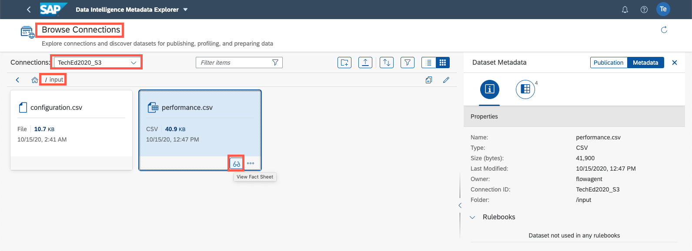


6. Click on the **Data Preview** button. Observe that all of the individual files from the source directory have been appended into a single consolidated csv file (The file size should be approx 83kb)

  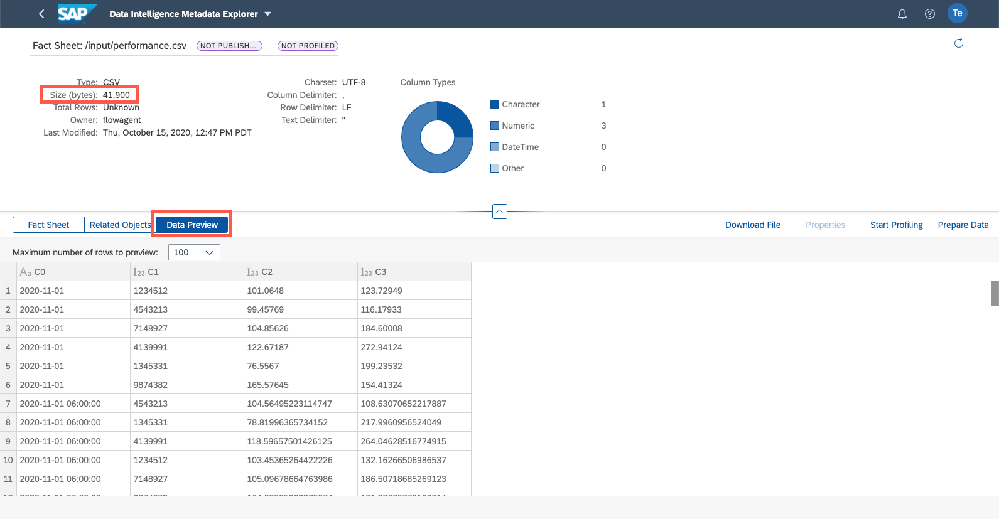

## Part 4: Copy Pipeline
We need the same data pipeline for consolidating the configuration files into on `configuration.csv`-file.

1. 'Save as..' the previous pipeline and name it to `FileCollectionConfiguration_TAxx`. Click on the **floppy disk** icon located in the toolbar at the top of the screen.
2. Change the configuration-parameters:
	1. "List-Files" operator, Path: "/device_configuration"
	2. "Write File" operator, Path: "/shared/TAxx/configuration.csv"
3. Run pipeline to create the configuration.csv-File

## Summary  

In this exercise you have consolidated a batch of csv files into a single csv file using the List, Read, and Write file operators. By using the Message Filter operator you were also able to gracefully terminate the pipeline when all files have been processed and written to S3. Finally, you were able to verify the correctness of your output using the Metadata Explorer.

[**Click here to move to the next exercise**](/exercises/ex2/README.md)  where you will learn to use the workflow operators to join and aggregate two csv files and store the result in a HANA database.
