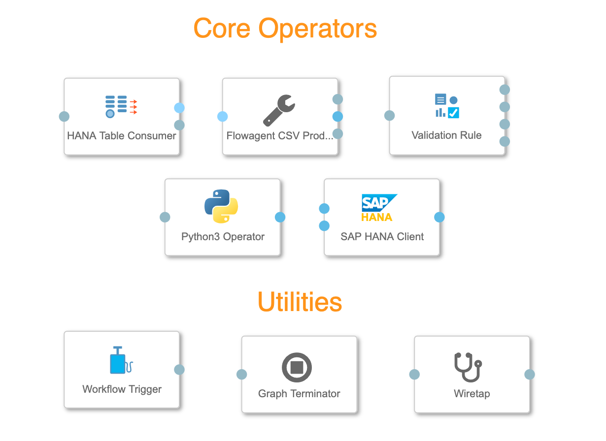
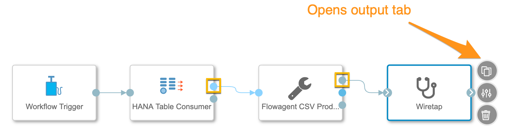
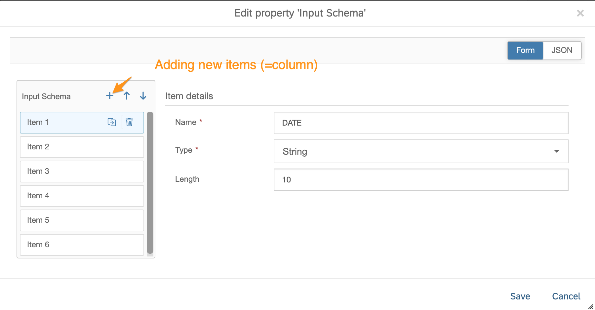
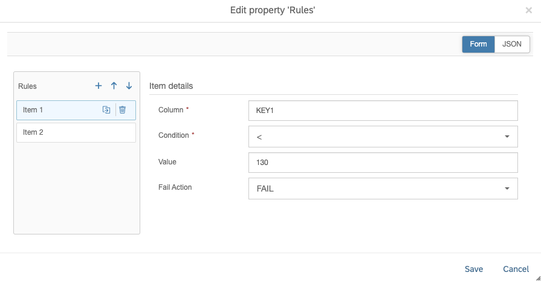
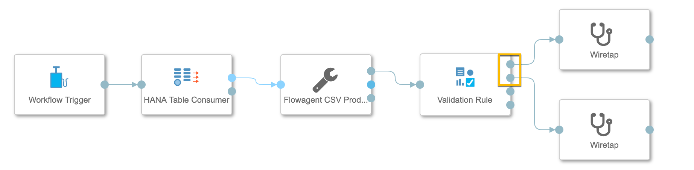
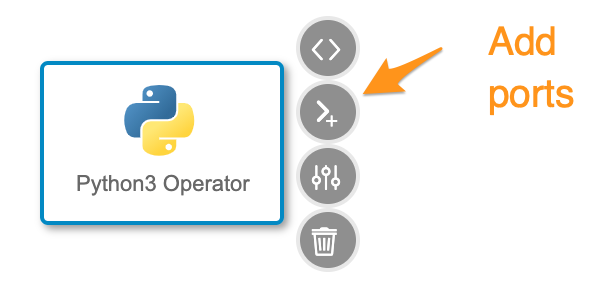
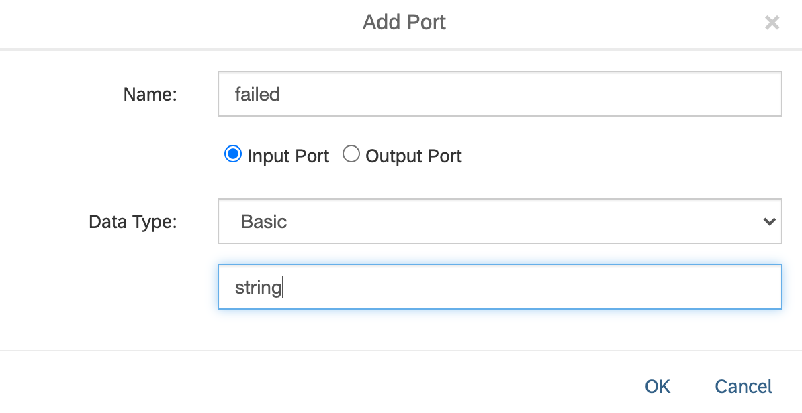
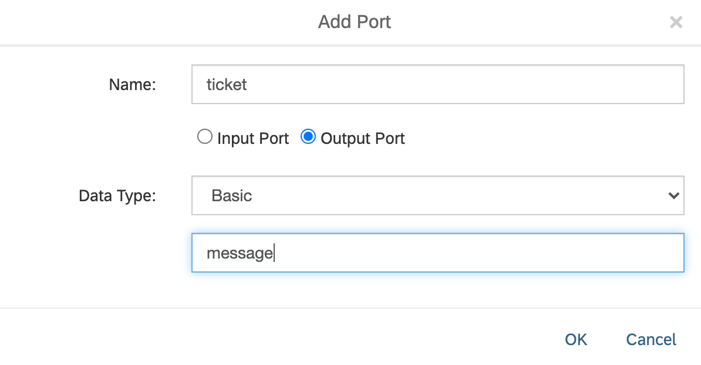

# Exercise 3: Validating Data Quality


## Description

In this exercise, we will validate the data saved to the HANA database in the previous exercise 2. In case of data failing the quality test, a service ticket is created with the failed data.

Below is a list of all the operators that you are going to need for this exercise:

|Name|Category|
|----|--------|
|HANA Table Consumer*|Connectivity (via Flowagent)|
|Flowagent CSV Producer|Connectivity (via Flowagent)|
|Validation Rule|Data Quality|
|Python3 Operator|Processing|
|SAP HANA Client*|Connectivity|

\* There are several other operators that you could use to read and write to HANA, however this would mean that you also might need other data type converters.  

## Exercise Summary
If you like to try it first by your own then here is the short summary of the tasks needed to be done:

1. Read the table `CELLSTATUS` created in [exercise 2](../ex2/README.html)
2. Add the `Validation Rule` operator and configure such that the values of the columns `KEY1` and `KEY2` must be greater than 0. The failed records should be channeled to the `fail`-outport.
3. Add a `Python3` operator and program it to create a new record for each failed record and send it to the outport as csv-string. The columns structure is as follows:
		("TIMESTAMP","STATUS","COMMENT","DATE","CELLID","NOM_KEY1","NOM_KEY2","KEY1","KEY2","ERROR_ACTION","ERROR_COLUMNS","ROW_ID")
4. Save the "service ticket" string to the HANA table `QMTICKET`

Hint: Depending on the HANA DB operator you might have the header passed as well. This you have to consider both with the "Validation"-Rule operator and with the script of the "Python3 Operator". For the latter we added a commented row that would rename the columns if the data provided with a header for complying with the following process steps.

## Exercise 3.1

[Video walkthrough: Wiretaps](https://www.youtube.com/watch?v=w0_0mIi7ohM&list=PLkzo92owKnVyY89xEshp_cSQ0QF8EE927&index=14)

1. Add the following operators to the pipeline canvas and connect them in this order:
	- `Workflow Trigger`
	- `HANA Table Consumer` (Use outport `outConfig`)
	- `Flowagent CSV Producer` (Use outport `outContent`)
	- `Wiretap`

2. Configure the `HANA Table Consumer` operator
	1. **HANA Connection:** `HANA_CLOUD_TECHED` or `HANA_LOCALHOST`
	2. **Source Table:** `"TECHED"."CELLSTATUS"`
	3. **Partition Type:** `default (None)`
	4. **Additional session parameters:** `default('')`
	5. **Fetch size:** `default (1000)`

3. Save the pipeline with the name `TAxx.ValidateDataQuality` where xx is your assigned workshop user ID.

4. Before we continue with the designing the pipeline we want to verify that data is being read correctly from HANA and rewritten into a CSV format. Start the pipeline and wait until it is in status `Running`. Click on the **Open UI** icon on the `Wiretap` operator. *(This icon only appears when the pipeline is running)* A new browser tab is opened and if everything is configured correctly CSV data should be displayed.

5. Stop the graph



## Exercise 3.2

[Video walkthrough: Validation rule](https://www.youtube.com/watch?v=8mMpScrA1ZU&list=PLkzo92owKnVyY89xEshp_cSQ0QF8EE927&index=15)

1. Add the `Validation Rule` operator and connect the preceding `Wiretap` operator or directly to the `Flowagent CSV Producer`
2. Configure the **Input Schema** of the `Validation Rule` operator: Click on *Edit*
	- In the new configuration window "Edit property 'Input Schema'
	- Add for each table column an item:

	|Name    |Type              |
	|--------|------------------|
	|DATE    |String (Length 10)|
	|CELLID  |Integer           |
	|NOM_KEY1|Number            |
	|NOM_KEY2|Number            |
	|KEY1    |Number            |
	|KEY2    |Number            |

	

3. Return to the operator's configuration menu and edit **Rules**:
	- Add the following rule:

	|Column|Condition|Value  |Fail Action|
	|------|---------|-------|-----------|
	|KEY1  |<        |130    |FAIL       |
	|KEY1  |>        |70     |FAIL       |


*This might look a bit counter-intuitive but it actually means all values > 130 and < 70 fail.*



3. All other configuration parameter leave as default.
4. Add two **Wiretab** operators and connect them to the outports **Validation Rule** named `pass` and `fail`.
5. Save and then Run the pipeline and check the output on both wiretaps. If your HANA table contains only one filtered record from Exercise 2 then you should see only a single failed record in the wiretap operator.


6. Stop the graph

## Exercise 3.3

[Video walkthrough: Python operators](https://www.youtube.com/watch?v=GYtyMPVPk3Y&list=PLkzo92owKnVyY89xEshp_cSQ0QF8EE927&index=16)

In this last section we will use Python to correct the failed records.

1. Add the `Python3` operator to the canvas and add in port and out port to the **Python3 Operator** operator   

2. Connect its in port to either to the outport of the **Wiretap** or the outport of the **Validation Rule** (fail)

3. Open the script tab by clicking on **Script** icon of the `Python3` operator. This will open a new tab inside the Pipeline Modeler. 
4. The operator comes with some sample code. Mark all of the text and delete it. Replace it with the following script:

```
import pandas as pd
import io
from datetime import datetime

def on_input(data):

    # Read data to DataFrame
    data_stream = io.StringIO(data)
    df = pd.read_csv(data_stream, names = ["DATE","CELLID","KEY1","KEY2","NOM_KEY1","NOM_KEY2","ERROR_ACTION","ERROR_COLUMNS","ROW_ID"] )
    #df.rename(columns={'ERROR ACTION':'ERROR_ACTION', 'ERROR COLUMNS' :'ERROR_COLUMNS', 'ROW ID':'ROW_ID'},inplace=True)

    # Add ticket information
    df["TIMESTAMP"] = datetime.now()
    df["STATUS"] = 'open'
    df["COMMENT"] = 'TAxx'
    df["ROW_ID"] = df["ROW_ID"].astype('int64')

    # resort DataFrame in case of order is important
    df = df[["TIMESTAMP","STATUS","COMMENT","DATE","CELLID","KEY1","KEY2","NOM_KEY1","NOM_KEY2","ERROR_ACTION","ERROR_COLUMNS","ROW_ID"]]

    api.send("ticket", api.Message(attributes={'data':'FAILED'},body=df.to_csv(index = False,date_format="%Y-%m-%d %H:%M:%S",header=False)))

# When data is received in the "failed" input port, call the on_input(data) function
api.set_port_callback("failed", on_input)

```

The basic idea of this script is to store the csv records ,which are coming from the `fail` outport of the `Validation Rule` operator, as an pandas DataFrame. Then we add some additional columns and values to this DataFrame, convert it back into a csv-format and send it to the outport `ticket`.
You could add in the ``df[comment] = 'TAxx'`` your workshop user-name to better find your QM tickets.

5. Add a new `Wiretap` operator to the canvas and connect it to the "Python3 Operator" outport.
6. Save and run the pipeline and check if the output is what you expected.

## Exercise 3.4
[Video walkthrough](https://www.youtube.com/watch?v=Gyv--hpav_w&list=PLkzo92owKnVyY89xEshp_cSQ0QF8EE927&index=17)

1. Add the `SAP HANA Client` operator to the canvas and connect its sql port  to either the outport of the **Wiretap** or directly to outport of the `Python3 Operator` operator
2. Configure the **SAP HANA Client**
	1. **Connection:** `Configuration Manager` -> `HANA_CLOUD_TECHED` or `HANA_LOCALHOST`
	2. **Table name:** `"TECHED"."QMTICKET"`. Don't forget to include the double quotes!
	3. All other parameters can be left at their default values
3. Finally, add **Graph Terminator** operator and connect it to the `HANA client` operator
4. Save and run the pipeline. It should eventually switch to status `Completed`.
5. Inspect your table `"TECHED"."QMTICKET"` via the Metadata Explorer to verify that the data was written as expected.


## Summary

You have learnt an alternative way to read and write to a HANA database as with the `Structured Data` operators of the previous exercise. We used the "Validation Rule" operator to do simple data quality checks and finally how to use a python custom operator to leverage all the options provided by an advanced script.

Continue to [Exercise 4: Analyse the Data with Jupyter Notebook](../ex4/README.md)
