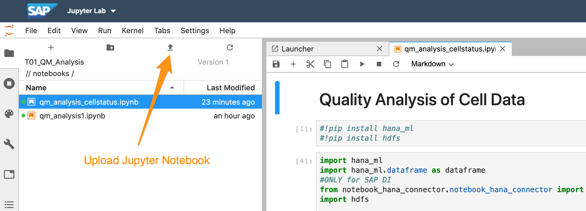

# Exercise 4: Analyse the Data with Jupyter Notebook

## Description
In order to understand better the data you receive from the devices and develop more precise predictions on when devices fail, you like to offer data scientists the chance to access the data with Jupyter Notebook.

## Exercise

1. Go the **Launchpad** of SAP Data Intelligence and start the **ML Scenario Manager**.
2. This is the data scientist environment to manage data, Jupyter notebooks, models and pipelines. Create a new Scenario by clicking on the **Create** Button on the top right corner and name it `TAxx_QM_Analysis` where xx is your assigned user ID


3. You will be taken to the **Scenario Details** page. Scroll down to the *Notebooks* section and create a new notebook .

4. Download the [scripts.zip](https://github.com/SAP-samples/teched2020-DAT263/blob/main/scripts.zip) file. There is a Jupyter Notebook that you can upload: `qm_analysis_cellstatus.ipynb` 
5. Before you run the Jupyter notebook you have to change the connection to direct to your table. Go to the cell where the connection is defined and change the table-name to `<TECHED_USER>_CELLSTATUS`. 
5. Now you can run the whole Jupyter notebook cell by cell by clicking on the run-button on the icon-bar. 
6. At the end of this Jupyter notebook you find blank cells where you can either do your own analysis or use our proposed code snippets. You can copy and paste these code snippets to the corresponding cells.


#### KEY1 for all Cells
```
mean = df['KEY1'].mean()
std = df['KEY1'].std()
print('Statistics:\n\tav: {}\n\tsd: {}'.format(mean,std))
exl_3s = df.loc[ (df.KEY1 < mean - 3*std) | (df.KEY1 > mean + 3*std),'KEY1'].count()
print('Z3-score: \n\tactual #values: {}\n\ttarget #values: {}'.format(exl_3s,round(0.0027*df.shape[0])))
```

#### KEY2 for all Cells
```
mean2 = df['KEY2'].mean()
std2 = df['KEY2'].std()
print('Statistics:\n\tav: {}\n\tsd: {}'.format(mean2,std2))
exl_3s = df.loc[ (df.KEY2 < mean2 - 3*std2) | (df.KEY2 > mean2 + 3*std2),'KEY2'].count()
print('Z3-score: \n\tactual #values: {}\n\ttarget #values: {}'.format(exl_3s,round(0.0027*df.shape[0])))
```

####  For Each Cell of KEY2
```
cells = df.CELLID.unique()
for c in cells:
    dfc = df.loc[df.CELLID == c]
    exl_3s = df.loc[(df.CELLID == c) & ((df.KEY2 < mean2 - 3*std2) | (df.KEY2 > mean2 + 3*std2)),'KEY2'].count()
    print('Z3-score {}: \n\tactual #values: {}\n\ttarget #values: {}'.format(c,exl_3s,round(0.0027*dfc.shape[0])))
```

####  Detailed look on the outliers
```
c = 1345331
dfc = df.loc[(df.CELLID == c) & ((df.KEY2 < mean2 - 3*std2) | (df.KEY2 > mean2 + 3*std2))]
display(dfc)
```

#### Access Data on DI Data Lake
To access the csv-files you have created from the Jupyter Notebook you currently have to store them first in the `DI_DATA_LAKE` connection.

 To do this you can either:
1. Use the download and upload feature of the Metadata Explorer or
2. Change the target of your pipeline that you have created in Exercise 2

*Remark: This might be changed in the next releases so you can access more connections of the Connection Management.*  

The code in Jupyter notebook could then look like the following:

```
client = InsecureClient('http://datalake:50070')
with client.read('/shared/Teched2020/TED_USER/performance.csv', encoding='utf-8') as reader:
   df_p = pd.read_csv(reader)
display(df_p)
```

## Summary

In this exercise you have learnt how to create a ML Scenario and a Jupyter Notebook, connect to a HANA database via the SAP Data Intelligence Connection and do some data analysis. You also can read data for the *DI_DATA_LAKE* storage.

Continue to [Exercise 5: Sending Device Data via RestAPI](../ex5/README.md)
