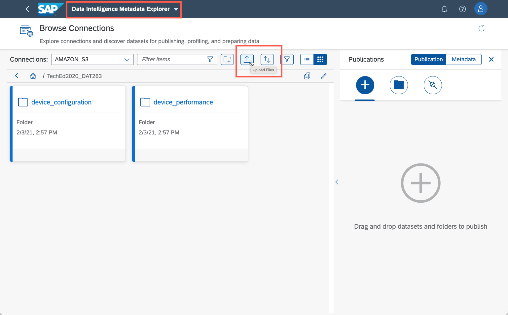

# Getting started DAT263 tutorials using your own SAP Data Intelligence instance

## Preparing your SAP Data Intelligence instance

One of the following SAP Data Intelligence versions:
* SAP Data Intelligence 3.1 On-premise edition, patch 0
* SAP Data Intelligence 3.1 Trial Edition
* SAP Data Intelligence Cloud Edition 2010 or newer

The following connections must be created in Connection Manager along with the following data. Note that these connections are already predefined in SAP Data Intelligence 3.1 Trial Edition
* A [cloud storage connection](https://help.sap.com/viewer/ca509b7635484070a655738be408da63/Cloud/en-US/eebfc9204af7440d87db7c876ea39a01.html) e.g S3 / GCS / WASB / ADL
  * Unzip and upload the contents of [dataset.zip](../../datasets/dataset.zip)
  * [Data can be uploaded directly using Metadata Explorer](https://help.sap.com/viewer/305fdeeaf7e84ff38cfeff576184472c/Cloud/en-US/59fe1b5c9c4d45b2b72115ef10cfe1c4.html)
* A [Smart Data Lake (SDL) connection](https://help.sap.com/viewer/ca509b7635484070a655738be408da63/Cloud/en-US/a6b555f56d8c4641bd1a248231202050.html) based on above cloud storage connection
* A [HANA Cloud or on-premise database connection](https://help.sap.com/viewer/ca509b7635484070a655738be408da63/Cloud/en-US/b8c286842b6c40be97a8aef108202348.html)
  * with [an empty QMTICKET table](../../datasets/QMTICKET.sql)

  

## Navigating around SAP Data Intelligence

In this workshop we will be working primarily with the **Modeler** application. The **Connection Manager** has been pre-configured with a HANA database connection as well as an Amazon S3 connection.

We will briefly use the **Metadata Explorer** application to browse these connections and preview some of the data we will be working with.

  

## Video walkthrough at SAP HANA Academy

If you do not have access to an instance of SAP Data Intelligence or need help going the tutorials then you can watch a video walkthrough on [SAP HANA Academy](https://www.youtube.com/playlist?list=PLkzo92owKnVyY89xEshp_cSQ0QF8EE927)

  

[**Continue to Exercise 1**](../ex1)
