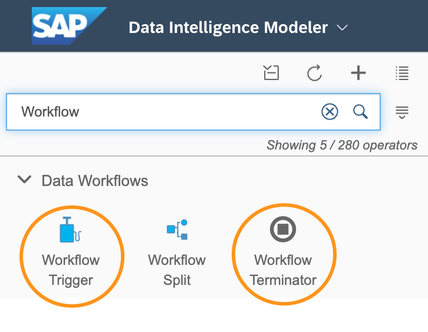
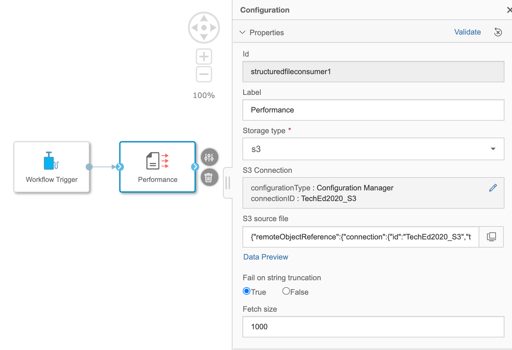

# Exercise 1 - Exercise 1 Description

In this exercise, we will merge the 2 files created in the previous exercise and store the result in a HANA Database. Due to some complexity we split the task into to parts. 

1. Read the "performance.csv" from an object store and after a projection and aggregation of the data we store the it to a HANA table.

2. Add the "configuration.csv" file and after a projection join it with the "transform" branch of the first part. 

For this excise you need the operators of the "Structured Data Operators" section and the "Workflow Trigger" and "Workflow Terminator" Operator.  

## Exercise 1.1 Sub Exercise 1 Description

After completing these steps you will have created a first projection, aggregation and saving data transformation. 

### Add first 2 operators
1. Create a new graph
2. Add the operators "Workflow Trigger" and "Structured File Consumer" to the canvas and connect them. 

*Additional info*: the reason for the "Workflow Trigger" is that otherwise the pipeline would not start. There are some operators like the "Structured Data Operator"-operators that needs a nudge others start when the pipeline was initialized. 

### Configure "Structured File Consumer" operator
Open the configuration of the "Structured File Consumer" operator to parameterize it. 

1. Label: 'Performance' - Just to make the pipeline more readable
2. Storage type (drop-down menu): 'S3'
3. S3 Connection (click on pencil-icon, opens pop-up window): Configuration Type - Configuration Manager and Connection ID - TechEd2020
4. S3 source file (click on screen-icon, opens pop-up window) : input/configuration.csv
5. Click on "Data Preview" for a check if there is the data you want.
6. Fail on string truncation: True - (Info: For the configuration only a data sample is read and the data types and sizes are inferred. Sometimes it is useful to set this option to 'False)
7. Fetch size: 1000 (default)

### Save the pipeline

1. Click on Save (mid-top of pipeline canvas)
2. In the pop-up window 'Save' enter: 
	1. Name: \<TECHUSER\>.MergeCellStatus
	2. Description: Merge to CellStatus
	3. Category: <TECHUSER>
3. Click "OK"

### Add Data Transform
This operator is doing the core part of the whole pipeline. 
1. Add "Data Transform" operator to the pipeline
2. 

## Summary

You've now ...

Continue to - [Exercise 2 - Exercise 2 Description](../ex2/README.md)

