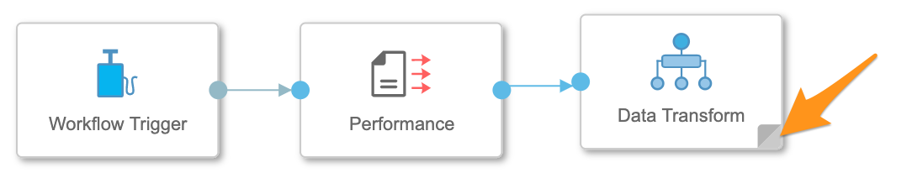
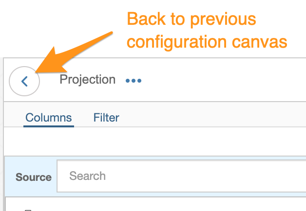
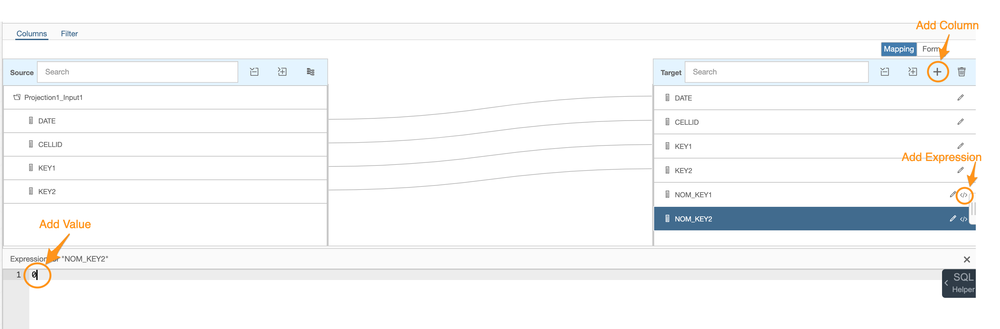

# Exercise 1 
## Description

In this exercise, we will merge the 2 files created in the previous exercise and store the result in a HANA Database. Due to some complexity we split the task into to parts. 

1. Read the "performance.csv" from an object store and after a projection and aggregation of the data we store the it to a HANA table.

2. Add the "configuration.csv" file and after a projection join it with the "transform" branch of the first part. 

For this excise you need the operators of the "Structured Data Operators" section and the "Workflow Trigger" and "Workflow Terminator" Operator.  

## Exercise Summary
If you have alread some experience with the "Structured Data Operators" operators then you might like to try it by your own instead of going through the detailed description of the excercises. Here are the main tasks you have to do:

### Exercise 1.1
1. Read in the file "performance.cvg" of the previous exercise
2. Add a "Transform" operator 
3. In the "Transform" operator add a "Projection" operator and name the target columns and convert to the data types ("C0" : "DATE" - date, "C1": "CELLID" - int32, "C2": "KEY1" - float32, "C3": "KEY" - float32
4. Add a "Aggregation"  operator and automap the input to the target. 
5. Click on the "edit"-icon of the target fields "KEY1" and "KEY2" and choose as "Aggregation Type": AVG. By this you reduce the table to having only a unique record for each day and device ("CELLID"). This you can then later join with the "configuration.csv" file where you have only a daily setting. 
6. Add a "Project" operator with additional target columns "NOM_KEY1"/float32 and "NOM_KEY2"/float32 and initialize them with "0". Add a filter for the "CELLID" and "DATE" to get finally get only one record for validation. This step is only necessary for an intermediate test.
7. Add an "output" operator
8. On the top-most pipeline level add a table producer with your target HANA table (TECHED.\<TECHED_USER>\_CELLSTATUS) and mode overwrite. 
9. Add a "Workflow Terminator" operator

Save, run and check the result. 

## Exercise 1.1 

### Description

After completing these steps you will have created a first projection, aggregation and saving data transformation. 

### Add first 2 operators 
1. Create a new graph
2. Add the operators "Workflow Trigger" and "Structured File Consumer" to the canvas and connect them. 

*Additional info*: the reason for the "Workflow Trigger" is that otherwise the pipeline would not start. There are some operators like the "Structured Data Operator"-operators that needs a nudge others start when the pipeline was initialized. 

### Configure "Structured File Consumer" operator for read "performance.csv" 
Open the configuration of the "Structured File Consumer" operator to parameterize it. 

1. Label: 'Performance' - Just to make the pipeline more readable
2. Storage type (drop-down menu): 'S3'
3. S3 Connection (click on pencil-icon, opens pop-up window): Configuration Type - Configuration Manager and Connection ID - TechEd2020
4. S3 source file (click on screen-icon, opens pop-up window) : input/configuration.csv
5. Click on "Data Preview" for a check if there is the data you want.
6. Fail on string truncation: True - (Info: For the configuration only a data sample is read and the data types and sizes are inferred. Sometimes it is useful to set this option to 'False)
7. Fetch size: 1000 (default)

### Save the pipeline

1. Click on Save (mid-top of pipeline canvas)
2. In the pop-up window 'Save' enter: 
	1. Name: \<TECHUSER\>.MergeCellStatus
	2. Description: Merge to CellStatus
	3. Category: <TECHUSER>
3. Click "OK"

### Add Data Transform
This operator is doing the core part of the whole pipeline. 

1. Add "Data Transform" operator to the pipeline
2. Draw a line from the outport of the "Structured File Consumer" to the "Data Transform". This results into a creation of an inport of the "Data Transform" operator and a connection. 
3. Double-click on the gray triangle at the right-bottom of the "Data Transform"-operator. This opens the "Data Transform" configuration canvas. 

4. Add the "Projection" operator, link the outport of the "input1" operator to the "Projection" operator and open the configuration of the operator by double-click on the gray-triangle. 
5. Do an "automapping" and change the name and the data tpyes at the target.
 with
	1. C1: "DATE" - date
	2. C2: "CELLID" - int32
	3. C3: "KEY1" - float32
	4. C4: "KEY2" - float32
6. Go back to the "Data Transform" (click on the link at the top-left corner  of the pipeline canvas. 
7. Add an "Aggregation" operator and connect it to the "Projection" operator. We are now doing an aggregation or groupby that we finally have only one record for each day and device (="CELLID").
8. Open the "Aggregation" configuration (click on the grey triangle at the bottom left corner).
9. Automap the input to the target (see 5.) and edit the target fields "KEY1" and "KEY2" (click on edit/pencil-icon) by choosing "AVG" (average) as the "Aggregration Type". By not selecting any "Aggregation Type" the field is implicitly used as a groupby column. 
10. Go back to the "Data Transform" and add again a "Projection" operator and connect it to the "Aggregation" operator. Do again an automapping and add to additional target columns "NOM_KEY1" (float32) and "NOM_KEY2" (float32) by clicking on the plus-icon. For the "Expression" just enter a "0".  This step is unnecessary for the final productive pipeline but for developing it is helpful to test intermediate steps.
11. Add a data filter for a more convenient check of the outcome. Click on the left-top corner "Filter"-link and add a kind of "WHERE"-condition: "CELLID" = 1234512 AND "DATE" = '2020-11-01'.  
12. Back on the "Transform" canvas right-click on the outport of the last "Projection" operator and add "Create Data target".  .
12. With clicking on the "auto-layout" you can straighten your pipeline and with clicking on the configuration icon of the "output" operator you can validate the data outcome of the "Transform" operator. .

## Configure "Table Producer" operator

1. Now back on the first pipeline layer (back button on the left top corner of the "Transform" canvas) you can add a "Table Producer" operator and connect it to the "Transform" operator.
2. For configuring the "Table Producer" you just need to open the configuration window by clicking on the common parameter-icon and enter the following configuration: 
	1. Label: HANA CELLSTATUS (or your description term)
	2. Database type: HANA
	3. HANA Connection: Configuration Type : Configuration Manager and connection ID: "HANA_CLOUD_TECHED"
	4. HANA Target Table: TECHED.\<TECHED_USER>\_CELLSTATUS. **Do not** select an existing table by clicking on the "screen"-icon but enter the name of the table literally. This creates an non-existant table using the data and data types provided by the input data.
	4. Mode: overwrite - creates a new table or overwrites an existing table with the new table structure. 
	5. Batch size: 1000 (default) 

## Final Step
1. Add and connect a "Workflow Terminator" and you are done. 

Now you can save and run the pipeline and checking the result with the **Metadata Explorer**. According to the filter of this example you should see only one record. 
	

## Exercise 1.2

### Description

The second part of the exercise is to add a join with the configuration-file in order to compare the daily settings with the average of performance send during the day. The latter and more complicated part has been accomplished already. You learnt the general concept of the "Structured Data Operators" therefore the following exercise might be much easier. 

### Read the configuration.csv file
Follow the **Exercise 1.1** : 

* *Add first 2 operators*  and 
* *Configure "Structured File Consumer" operator for read "performance.csv"*  

but use instead the file "configuration.csv" generated in the **Exercise 0** and for the "Label" use "Configuration".

### Add new Input to the existing "Data Transform" operator

For adding a new input to the existing "Data Transform" operator drag a connection from the output of the "Structured File Consumer" into the "Data Transform" operator and a new inport is created. 

### Adjust the "Data Transform" Operator

When opening the "Data Transform" operator canvas you see a second input operator "input2" that provides the read data from the configuration file. 

## Summary

You've now ...

Continue to - [Exercise 2 - Exercise 2 Description](../ex2/README.md)

