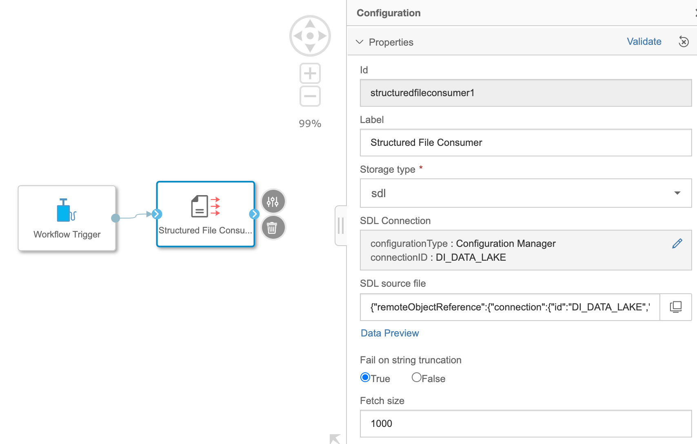
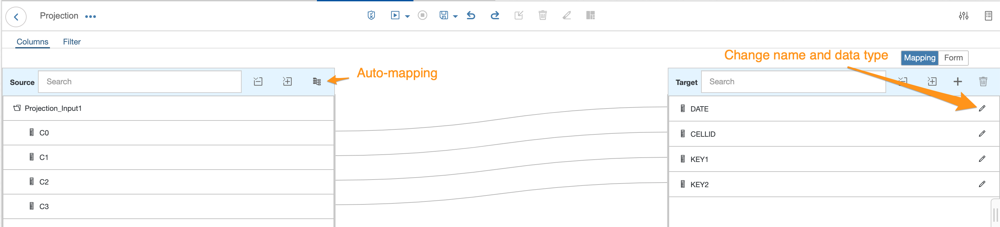
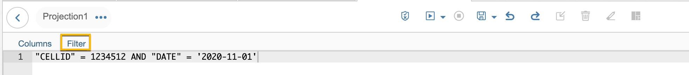
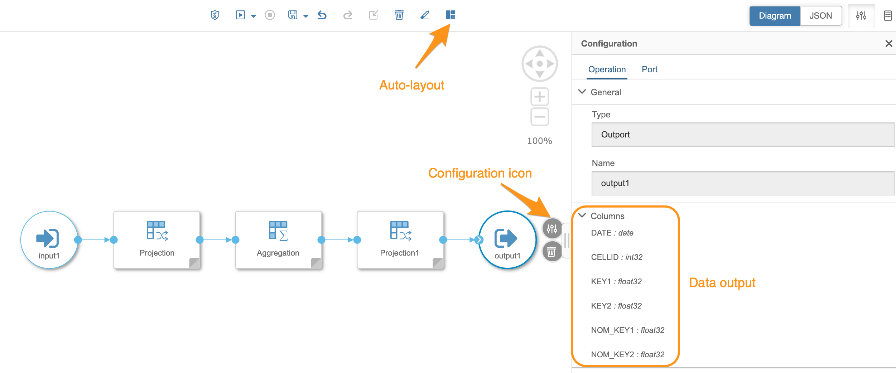
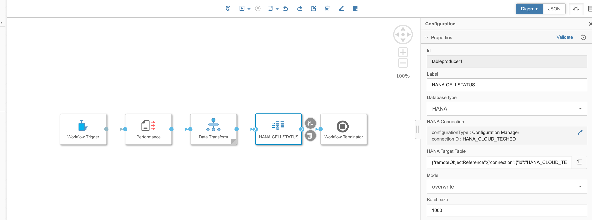
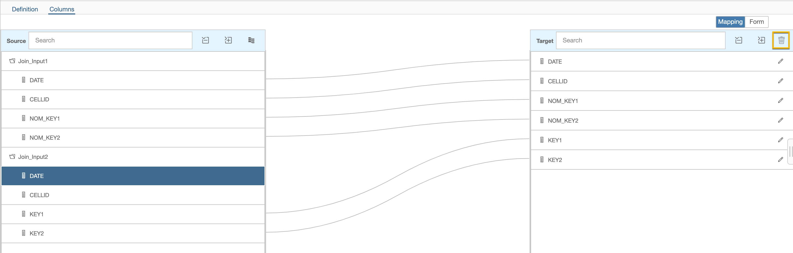
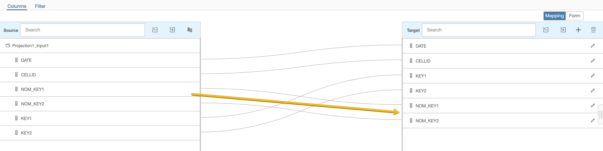

# Exercise 2: Joining and writing workflow data to SAP HANA
## Description

**Objective:** In this exercise, we will merge the two files created in the previous exercise and store the result in a HANA Database. To do this we will introduce you to the **Structured Data operators** as well as the **Data Workflow operators**.   To reduce complexity this exercise has split the task into to parts:

1. Read the ``performance.csv`` from an object store and after a projection and aggregation of the data we store the it to a HANA table.

2. Add the ``configuration.csv`` file and after a projection join it with the "transform" branch of the first part.


## Exercise Summary
If you have already some experience with the "Structured Data Operators" operators then you might like to try it by your own instead of going through the detailed description of the exercises. Here are the main tasks you have to do:

### Exercise 2.1
1.	Create a new graph
2.	Use the `Structured File Consumer` operator read in the file ``performance.csv`` which was generated in the previous exercise .
3.	Add a `Data Transform` operator to your graph
4.	Add the `Projection` operator and name the target columns and convert to the data types ``("C0" : "DATE" - date, "C1": "CELLID" - int32, "C2": "KEY1" - float32, "C3": "KEY" - float32``
5.	Add a `Aggregation`  operator and automap the input to the target.
6.	Click on the "edit"-icon of the target fields "KEY1" and "KEY2" and choose as "Aggregation Type": AVG. By this you reduce the table to having only a unique record for each day and device ("CELLID"). This you can then later join with the "configuration.csv" file where you have only a daily setting.
7.	Add a "Project" operator with additional target columns "NOM_KEY1"/float32 and "NOM_KEY2"/float32 and initialize them with "0". Add a filter for the "CELLID" and "DATE" to get finally get only one record for validation. This step is only necessary for an intermediate test.
8.	Add an "output" operator
9.	On the top-most pipeline level add a table producer with your target HANA table (TECHED.\<TECHED_USER>\_CELLSTATUS) and mode overwrite.
10.	Add a "Workflow Terminator" operator


Save, run and check the result.


## Exercise 2.1

### Description

After completing these steps you will have created a first projection, aggregation and saving data transformation.

### Add first 2 operators
1. Create a new graph using the **+** icon in the upper left corner of the modeler

	*Note*: Unlike the `List Files` operator that you used in the previous exercise many other operators like the `Structured Data` operators  require an input in order to beginning the pipeline execution. For this reason we must include the `Workflow Trigger` operator to our graph.

2. Add the operators `Workflow Trigger` and `Structured File Consumer` to the canvas and connect them.

	


### Configure "Structured File Consumer" operator for read "performance.csv"
Right click the `Structured File Consumer` operator and open the configuration menu to parameterize it.

1. (Optional) Rename the **Label** to `Performance`. This makes the pipeline more readable
2. Set **Storage type** (drop-down menu): `sdl`
3. In sdl Connection, click on pencil-icon and set
	* **Configuration Type**: `Configuration Manager`
	* **Connection ID**:  `DI_DATA_LAKE`
	* Save
4. Select the source file by clicking on **monitor-icon** : `/shared/TAxx/performance.csv`
5. You may click on the **Data Preview** button to inspect the data you are working with
6. Set **Fail on string truncation**: `True`

	*Info* This operators reads a small sample of the dataset to infer the length of a string data type. When this parameter is set to `True`  reader will exit and fail if a string truncation has happened. This behavior happens when the length of a string in the metadata is smaller than the actual data in the source file.

7. Set **Fetch size**: `1000` records (default)



### Save the pipeline

1. Click on Save (mid-top of pipeline canvas)
2. In the pop-up window 'Save' enter:
	1. Name: \<TECHUSER\>.MergeCellStatus
	2. Description: Merge to CellStatus
	3. Category: <TECHUSER>
3. Click "OK"


### Add Data Transform
This operator is doing the core part of the whole pipeline.

1. Add `Data Transform` operator to the pipeline
2. Draw a line from the outport of the `Structured File Consumer` onto the `Data Transform` operator. This results into a creation of a new input  port of the `Data Transform` operator
3. Double-click the `Data Transform`. This opens a new modeling perspective.
	

4. From the operator list on the left, add the "Projection" operator, link the outport of the "input1" operator to the "Projection" operator and open the configuration of the operator by double-click on the gray-triangle.

	

5. Click on the **automapping** button and change the name and the data types at the target according to below table.
	

	|Source|Target |DataType|
	|------|-------|--------|
	|C0    |DATE   |date    |
	|C1    |CELLID |int32   |
	|C2    |KEY1   |float32 |
	|C2    |KEY2   |float32 |


6. Return to the modeling view by clicking on the **<** icon in the top-left corner  of the pipeline canvas. 
7. We can now perform an aggregation, similar to that of a SQL Group By, such that that we will get one distinct record for each day and device (="CELLID"). Add an `Aggregation` operator and connect it to the `Projection` operator.

	

8. Open the configuration screen by **double clicking** on the `Aggregation` operator or **click on the grey triangle** at the bottom right corner
	* Automap the source to the target (like in step 5.)
	* Edit the target fields `KEY1` and `KEY2` by using the pencil-icon
		* For both columns set **Aggregation Type**: `AVG` (average)
		* Note: By not selecting any "Aggregation Type" the field for the remaining columns they are implicitly used as a groupby column.
		
		


10. Return to the `Data Transform` modeling view and add second a `Projection` operator and connect it to the `Aggregation` operator.
- Double click the operator to configure it
- Once again an automap the source to target
- Add two additional target columns by clicking on the **+** icon with the following properties:
	- `NOM_KEY1 (float32)` and `NOM_KEY2 (float32)`
	- In the `Expression editor` below simply enter a ```0```.
	

11. (Optional) This step is unnecessary for the final productive pipeline but for developing it is helpful to test intermediate steps.
	- Switch to the **Filter** tab
	- Add a condition, similar to that of  SQL WHERE condition:

			"CELLID" = 1234512 AND "DATE" = '2020-11-01'
	 
12. Return to the `Data Transform` modeling perspective and right-click on the outport of the last `Projection` operator and select `Create Data target`.
 .
12. By clicking on the **auto-layout** you can rearrange your pipeline
13. Open the **Configuration** menu of the `output` operator. Under the **General** section you can verify the outgoing columns of the `Transform` operator. .

## Configure "Table Producer" operator

1. Return to the main pipeline modeling perspective by using the **<** button in the top-left corner of the `Data Transform` canvas.
2. Add a `Table Producer` operator and connect it's input to the output `Data Transform` operator.
2. Configure the `Table Producer` with the following parameters:
	1. Rename **Label**: `HANA CELLSTATUS` (or your own preferred description term)
	2. **Database type**: `HANA`
	3. **HANA Connection**:
		- **Configuration Type** : `Configuration Manager`
		- **Connection ID**: `HANA_CLOUD_TECHED`
	4. **HANA Target Table**: `TECHED.<TECHED_USER>_CELLSTATUS`. **Do not** select an existing table by clicking on the "screen"-icon but enter the name of the table literally. This creates an non-existant table using the data and data types provided by the input data.
	4. **Mode**: `overwrite` - creates a new table or overwrites an existing table with the new table structure.
	5. **Batch size**: `1000` (default)

## Final Step
Add and connect a `Workflow Terminator` and you are done! Now you can save and run the pipeline and check the result with the **Metadata Explorer**. If you set filter in step 11 of this example you should see only one record.

 


## Exercise 2.2

### Description

The second part of the exercise is to add a join with the configuration-file in order to compare the daily settings with the average of performance send during the day. The latter and more complicated part has been accomplished already. You learnt the general concept of the "Structured Data Operators" therefore the following exercise might be much easier.

### Read the configuration.csv file into the Data Transform operator
Similar to what you already did in **Exercise 2.1** :

* Add the `Workflow Trigger` and `Structured File Consumer` operators
* Configure `Structured File Consumer` operator:
	- Rename the **Label** to `Configuration`
	- Set storage type to `sdl`
	- Set **S3 Connection** to `DI_DATA_LAKE`
	- Choose **S3 Source file** to be `/shared/TAxx/configuration.csv`
* Connect the output of the `Structured File Consumer` operator to the existing `Data Tranform` operator. This will automatically create a new input port.


### Adjust the "Data Transform" Operator

Double click the `Data Transform` operator to open it. You will then see a second input operator `input2` that provides the read data from the configuration file.

1. Add a new `Projection` operator and connect it to the new `input2` operator
2. Configure the new `Projector` operator
	1. **Automap** the source columns to target columns
	2. Change the names and the data types of the target columns as follows:

		|Source|Target|DataType|
		|--|--------|-------|
		|C1|DATE    |date   |
		|C2|CELLID  |int32  |
		|C3|NOM_KEY1|float32|
		|C4|NOM_KEY2|float32|

3. Add a `Join` operator and connect the new `Projection2` operator to the top `inport` of the `Join` operator
4. Remove the connection from the `Aggregation` output operator to the `Projection1` operator by clicking on the connection to mark it and then right-click to remove it. 

5. Connect the outport of the `Aggregation` operator with the bottom `inport` of the `Join` operator
6. Configure the `Join` operator
	1. From the **Definition view**, join both input `DATE` columns by dragging one join column to the other.
	2. In the opened **Join Definition** section you should now see the join. If it does not display, simply double click the link between the two inputs.
			"Join_Input1"."DATE" = "Join_Input2"."DATE".
		Create a composite join by also joining together the `CELLID` columns from both inputs:
			"Join_Input1"."DATE" = "Join_Input2"."DATE" AND "Join_Input1"."CELLID" = "Join_Input2"."CELLID"

		
	3. Switch to **Columns view** (left top corner link)
	4. `Automap` the source to target
	5. Remove one `DATE` and one `CELLID` target columns by marking the target column and clicking on the wastebasket icon 
7. Connect the Join `outport` with the `inport` of the `Projection1` that is sending its output to the "output" operator.
8. Open the `Projection` configuration and map the source columns `NOM_KEY1` and `NOM_KEY2` to the corresponding target columns.
	
9. Return to the main pipeline layer, save the graph and start it.

Again you should see only one record if you chose to apply the the filter but this time it should include all columns with populated values.

**Attention!** If you have duplicate rows you might consider that it is because your input has already contained the duplicate rows. This may occur if you re-run the pipeline from Exercise 1 where data is appended to the source file. In such cases you need to make sure to delete any existing target file before rerunning the pipeline from Exercise 1.


## Summary

You've now actually created a rather complex data transformation from two different data sources, with joins, aggregation and filtering and storing it to a different type of storage.

Continue to [Exercise 3: Validating Data Quality](../ex3/README.md)
