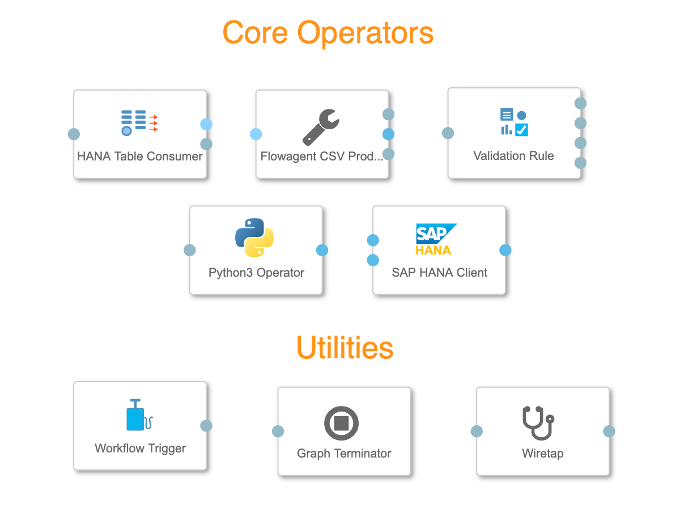

# Exercise 3: Validating Data Quality


## Description

In this exercise, we will validate the data saved to the HANA database in the previous exercise 2. In case of data failing the quality test, a service ticket is created with the failed data. 

The operators you are going to need for this exercise are **HANA Table Consumer** and **Flowagent CSV Producer** (section: "Connectivity (via Flowagent),  **Validation Rule** (section: "Data Quality"), **Python3 Operator** (section: "Processing") and the **SAP HANA Client** (section: "Connectivity"). You could of course use other operators for reading and writing to HANA. This would mean that you also might need other data type converters.  

## Exercise Summary
If you like to try it first by your own then here is the short summary of the tasks needed to be done: 

1. Read the table "CELLSTATUS" of the previous table
2. Add the "Validation Rule" operator and configure it that the values of the columns "KEY1" and "KEY2" have to be larger then 0. The failed records should be channeled to the "fail"-outport. 
3. Add a "Python3 Operator" and create a new record for each failed record and send it to the outport as csv-string (structure: "TIMESTAMP","STATUS","COMMENT","DATE","CELLID","NOM_KEY1","NOM_KEY2","KEY1","KEY2","ERROR_ACTION","ERROR_COLUMNS","ROW_ID")
4. Save the "service ticket" string to the HANA table "QMTICKET"

## Exercise 3.1 

1. Add the **Workflow Trigger** and the HANA Table Consumer and the "Flowagent CSV Producer" to the pipeline canvas. Connect the ports (Choose HANA Table Consumer outport "outConfig").
2. Configure the **HANA Table Consumer** operator
	1. HANA Connection: HANA_CLOUD_TECHED
	2. Source Table: "TECHED"."CELLSTATUS"
	3. Partition Type: default (None)
	4. Additional session parameters: default('')
	5. Fetch size: default (1000)
3. Connect a **Wiretap** operator to the "Flowagent CSV Producer" outport "outContent/string). 


Start the pipeline and have a peek if the records are read by clicking on the "open UI" icon. This icon only appears when the pipeline is running. An addition tab is opened in your browser where you could the output. 

## Exercise 3.2 

1. Add the **Validation Rule** operator either to the outport of the **Wiretap** or the outport of the **Flowagent CSV Producer** (outContent/string)
2. Configure the **Validation Rule** operator
	1. "Input Schema" - click on 'edit'-button opens a new configuration window "Edit property 'Input Schema' 
	2.  Add for each table column an item: ("DATE"/String/10, "CELLID"/Integer, "NOM_KEY1"/Number, "NOM_KEY2"/Number, "KEY1"/Number, "KEY2"/Number) 
	3. "Rules" click on 'edit'-button opens a new configuration window "Edit property 'Rules' 
	4. Add to Rules: Column: "KEY1", Condition: ">", Value: "0", Fail Action: "FAIL
3. All other configuration parameter leave as default. 
4. Add a **Wiretab** operator to the outports of the **Validation Rule** outports "pass" and "fail". 
5. Run the pipeline and check the output on both wirtabs. 

## Excercise 3.3

1. Add the **Python3 Operator** operator either to the outport of the **Wiretap** or the outport of the **Validation Rule** (fail)
2. Add inport and outport to the **Python3 Operator** operator    
3. Open the script tab by clicking on "Script" icon of the **Python3 Operator**. 
4. You will find a couple of examples that covers the basic use cases for this operator. Mark all the text and delete it. Replace it with the following script: 

```
import pandas as pd
import io
from datetime import datetime

def on_input(data):

    # Read data to DataFrame
    data_stream = io.StringIO(data)
    df = pd.read_csv(data_stream)
    df.rename(columns={'ERROR ACTION':'ERROR_ACTION', 'ERROR COLUMNS' :'ERROR_COLUMNS', 'ROW ID':'ROW_ID'},inplace=True)
    
    # Add ticket information
    df["TIMESTAMP"] = datetime.now() 
    df["STATUS"] = 'open'
    df["COMMENT"] = ''
    df["ROW_ID"] = df["ROW_ID"].astype('int64')
    
    # resort DataFrame in case of order is important
    df = df[["TIMESTAMP","STATUS","COMMENT","DATE","CELLID","NOM_KEY1","NOM_KEY2","KEY1","KEY2","ERROR_ACTION","ERROR_COLUMNS","ROW_ID"]]

    api.send("ticket", api.Message(attributes={'data':'FAILED'},body=df.to_csv(index = False,date_format="%Y-%m-%d %H:%M:%S",header=False)))


api.set_port_callback("failed", on_input)

```

The basic idea of the script is reading the records (csv-format) conveyed through the inport "failed" as an pandas DataFrame, adding some additional information, convert it back into a csv-format and sending it to the outport "ticket". 	 
5. Add a "Wiretab" operator to the "Python3 Operator" outport. 
6. Save and run the pipeline and check if the output is what you expected. 

## Exercise 3.4

1. Add the **SAP HANA Client** operator either to the outport of the **Wiretap** or the outport of the **Python3 Operator** operator
2. Configure the **SAP HANA Client**
	1. Connection: Configuration Manager/HANA_CLOUD_TECHED
	2. Table name: "TECHED"."QMTICKET"
	3. All other parameters leave as default
3. Add **Graph Terminator** operator
4. Save and run the pipeline and check if the output is what you expected (Metadata Explorer). 


## Summary

You have learnt an alternative way to read and write to a HANA database as with the "Structured Data Operators" of the previous exercise. We used the "Validation Rule" operator to do simple data quality checks and finally how to use a python custom operator to leverage all the options provided by an advanced script. 

Continue to - [Exercise 4](../ex4/README.md)
