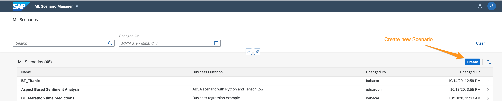
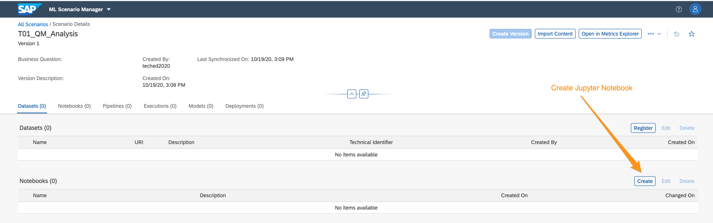
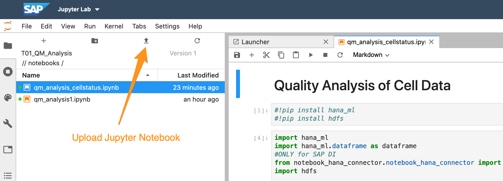

# Exercise 4: Analyse the Data with Jupyter Notebook

## Description
In order to understand better the data you receive from the devices and develop more precise predictions on when devices fail, you like to offer data scientists the chance to access the data with Jupyter Notebook. 

## Exercise 

1. Go the **Launchpad** of SAP Data Intelligence and start the **ML Scenario Manager**. This is the data scientist environment to manage data, jupyter notbooks, models and pipelines. 
2. Create a new Scenario by clicking on the **Create** Button on the top left corner.  and name it \<user\_id\>\_QM_Analysis
3. In the **Scenario Details** page create a new pipeline in the section "Pipelines". .
4. Download the [scripts.zip](../../scripts.zip) file. There is a Jupyter Notbook that you can upload: "qm_analysis_cellstatus.ipynb" 
5. Finally we have to change the data source location from a local folder to the HANA database added as a Connection in SAP Data Intelligence.
	1. Comment all rows of 1st code cell (#!pip install hana_ml...)
	2. Uncomment 4th line in 2nd code cell (from notebook_hana_connector.notebook_hana_connector import NotebookConnectionContext)
	3. Uncomment HANA ML and comment read_csv line 

```
#FOR HANA ML
conn = NotebookConnectionContext(connectionId = 'HANA_CLOUD_TECHED')
df = conn.table('CELLSTATUS', schema='TECHED').collect()
#df = pd.read_csv("/Users/Shared/data/IoTquality/cellstatus.csv")
display(df)
```

Now you can run the whole jupyter notebook and do your own research.

## Summary

In this exercise you have learnt how to create a ML Scenario and a Jupyter Notebook, connect to a HANA database via the SAP Data Intelligence Connection and do some data analysis. 


