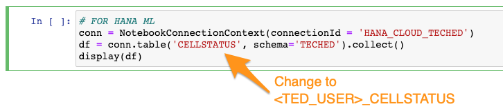
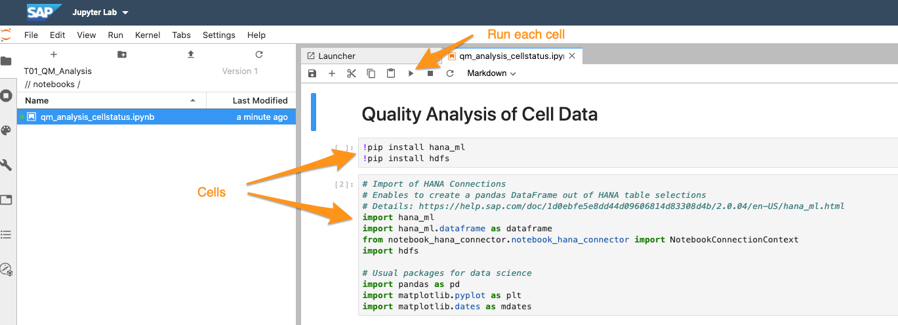

# Exercise 4: Analyse the Data with Jupyter Notebook

## Description
In order to understand better the data you receive from the devices and develop more precise predictions on when devices fail, you like to offer data scientists the chance to access the data with Jupyter Notebook.

## Exercise

1. Go the **Launchpad** of SAP Data Intelligence and start the **ML Scenario Manager**.
2. This is the data scientist environment to manage data, Jupyter notbooks, models and pipelines. Create a new Scenario by clicking on the **Create** Button on the top left corner and name it `TAxx_QM_Analysis` where xx is your assigned user ID


3. You will be taken to the **Scenario Details** page. Scroll down to the *Notebooks* section and create a new notebook , enter any name and when prompted select python3 kernel.

4. Download the [scripts.zip](../../scripts.zip) file. There is a Jupyter Notbook that you can upload: `qm_analysis_cellstatus.ipynb` 
5. Under section *Connection to Data Source* modify the table-name `CELLSTATUS` to `<TECHED_USER>_CELLSTATUS` to reflect your assigned user ID 
5. You can execute the code in a selected by clicking on the run-button on the icon-bar. Starting from the top do this for every cell in this notebook 
6. At the end of this Jupyter notebook you find blank cells where you can either do your own research or copy/paste the provided code snippets to query and manipulate the data further.


#### KEY1 for all Cells
```
mean = df['KEY1'].mean()
std = df['KEY1'].std()
print('Statistics:\n\tav: {}\n\tsd: {}'.format(mean,std))
exl_3s = df.loc[ (df.KEY1 < mean - 3*std) | (df.KEY1 > mean + 3*std),'KEY1'].count()
print('Z3-score: \n\tactual #values: {}\n\ttarget #values: {}'.format(exl_3s,round(0.0027*df.shape[0])))
```

#### KEY2 for all Cells
```
mean2 = df['KEY2'].mean()
std2 = df['KEY2'].std()
print('Statistics:\n\tav: {}\n\tsd: {}'.format(mean2,std2))
exl_3s = df.loc[ (df.KEY2 < mean2 - 3*std2) | (df.KEY2 > mean2 + 3*std2),'KEY2'].count()
print('Z3-score: \n\tactual #values: {}\n\ttarget #values: {}'.format(exl_3s,round(0.0027*df.shape[0])))
```

####  For Each Cell of KEY2
```
cells = df.CELLID.unique()
for c in cells:
    dfc = df.loc[df.CELLID == c]
    exl_3s = df.loc[(df.CELLID == c) & ((df.KEY2 < mean2 - 3*std2) | (df.KEY2 > mean2 + 3*std2)),'KEY2'].count()
    print('Z3-score {}: \n\tactual #values: {}\n\ttarget #values: {}'.format(c,exl_3s,round(0.0027*dfc.shape[0])))
```

####  Detailed look on the outliers
```
c = 1345331
dfc = df.loc[(df.CELLID == c) & ((df.KEY2 < mean2 - 3*std2) | (df.KEY2 > mean2 + 3*std2))]
display(dfc)
```

#### Access Data on DI Data Lake
If you want to access the csv-files you have created from the Jupyter Notebook you currently have to store them first in the `DI_DATA_LAKE`.

Remark: This might be changed in the next releases so you can access more connections of the Connection Management.  

 For this you can

1. use the download and upload feature of the Metadata Explorer or
2. change the target of your pipline that you have created in Exercise 2

The code could then look like the following:

```
client = InsecureClient('http://datalake:50070')
with client.read('/shared/Teched2020/TED_USER/performance.csv', encoding='utf-8') as reader:
   df_p = pd.read_csv(reader)
display(df_p)
```

## Summary

In this exercise you have learnt how to create a ML Scenario and a Jupyter Notebook, connect to a HANA database via the SAP Data Intelligence Connection and do some data analysis. You also can read data for the *DI_DATA_LAKE* storage.

[Exercise 5](../ex5/README.md)
