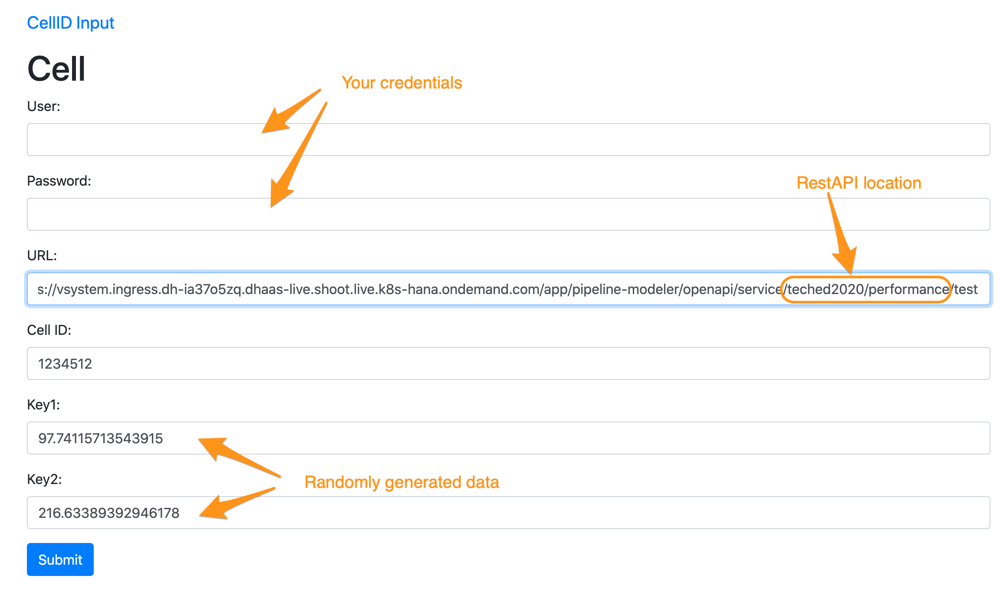
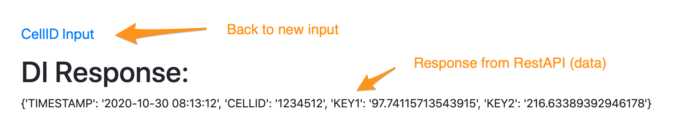

# Exercise 5: Sending Device Data via RestAPI

## Description
In this exercise we create a RestAPI that could be called by devices to save the performance data to a file. That could be the very beginning of the whole use case you just accomplished so far.  
1. Devices are sending data to SAP Data Intelligence
2. Data is stored to HANA database
3. Quality assurance test verifies if the data is within the expected boundaries.
4. All failed data are recorded to a "QMTICKET" table to rectify the data or resolve any issues with devices
5. Further analysis by a data scientist could develop more sophisticated quality checks and create and even better prediction on failed data


## Exercise Summary

Creating a Pipeline with a web-service that can be called externally and hand over the data to an operator for further processing before calling an operator for saving the data. 

In order to test the Rest-API a client application is provided that generates example data and sends it to the web-service. Of course also the "postman" application can be used or the terminal command "curl". 

## Exercise 5.1
Each running pipeline consumes a node in the cluster. Due to the limited size of our workshop-cluster we ask you kindly to ensure that the web-service pipeline is only running as short as possible. For testing purpose we write the web-service response to a file and then terminate the graph. 

Creating the basic RestAPI:

1. Create new Graph
2. Add the RestAPI operator **OpenAPI Servlow** and the **Wiretap** opertorator
3. Configure the **OpenAPI Servlow** operator
	1.  Base Path: 'teched2020/\<di_user\>\_performance - This defines which service the Web-server calls. (Attention: No leading '/')
	2. One-Way: True (operator is not waiting for a response but sends immediatedly HTTP 204 back. 
4. Add the **Write File** operator and the **To File** converter
5. Configure the **Write File** operator for adding the data to your "performance.csv": 
	1. Connection: DI_DATA_LAKE
	2. Path mode: "Static (from configuration)
	3. Path: */shared/\<di_user\>/performance.csv* 
	4. Mode: "Append"
6. Add the **Workflow Terminator** to the graph. Of course if run productivly there would be no "Terminator" but run perpetually.
7. Connect all operators  
8. Save the pipeline as "taxx.DeviceRestAPI"


### Postman 
#### Request URL

POST and url: \<url pipeline modeler\>/openapi/service/\<di_user\>\_performance/test

It is important to add a process-tag at the end, otherwise the request gets an error although the process tag is not used. 

#### Request Header
In the "Headers"-tab add the parameter: X-Requested-With - XMLHttpRequest. Without this parameter you get the error: "Forbidden cross-site request"


#### Authorization
1. Change the authorization TYPE: Basic Auth
2. Enter your credentials while adding before your user the tenant name 'default' separated with a backslash '\'.


#### Request Body

In the body you can add the actual data that should be posted. Here we can add already a JSON that contains the data of the device: 

{"TIMESTAMP":"2020-10-19 20:06:55","CELLID":1234512,"KEY1":111.1,"KEY2":222.2}


#### Test 

1. Now you can start the pipeline
2. When the pipeline is running send the postman request by pushing the "Send" button. 
3. The received request is saved to the specified file and the pipeline terminates
4. Check the file. 


### Python client

If you have a python-egine installed on your local system then you could also use the script that you have downloaded from this GitHub repository together with the Jupyter Notebook: [scripts.zip](../../scripts.zip).

First you have to ensure that the url in the script is the right one. Open the script with a text editor and verify and adjust the url described in the section Postman/Request URL.

Start the RestAPI pipeline and wenn running then start the script in a terminal with: 

```
python3 ./celldata.py --cellid 1234512 --user <di_user> --pwd <password>
```

### HTML Test Page

The easiest way to test the RestAPI is using the page we created to test the restapi [Test Page (sendcelldata.cfapps.eu10.hana.ondemand.com)]
(sendcelldata.cfapps.eu10.hana.ondemand.com).






## Summary

You have learnt how to setup a RestAPI and sending data to it. 


