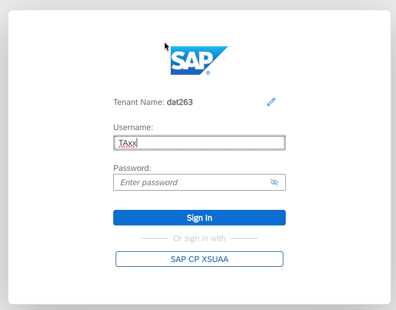
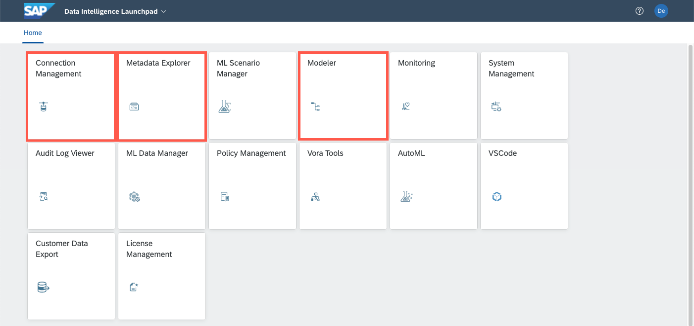

# Getting started with SAP Data Intelligence

## Logging on to SAP Data Intelligence

Obtain a unique user ID at the SAP Data Intelligence workshop registration page: https://workshop_registration.cfapps.eu10.hana.ondemand.com/register/Thorsten​

* Please do not create more than one user!
* If you forget your credentials let us know

  Tenant: `ws02` 
  Username: `TAxx` where xx is your assigned number 
  Password: `<your_assigned_password>` 

  Logon URL: [https://vsystem.ingress.dh-ddcl5663x.dh-canary.shoot.live.k8s-hana.ondemand.com/login/?tenant=ws02/](https://vsystem.ingress.dh-ddcl5663x.dh-canary.shoot.live.k8s-hana.ondemand.com/login/?tenant=ws02)

  

## Navigating around SAP Data Intelligence

In this workshop we will be working primarily with the **Modeler** application. The **Connection Manager** has been pre-configured with a HANA database connection as well as an Amazon S3 connection.

We will briefly use the **Metadata Explorer** application to browse these connections and preview some of the data we will be working with.

  
